# 🛠️ Documentation de la base de données

## 📝 Introduction

La base de données d'Hypérion Education V2 est gérée avec PostgreSQL et modélisée via Prisma ORM. Elle est conçue pour stocker et organiser les parcours d'apprentissage, les utilisateurs, les cours et les exercices. Cette documentation présente la structure des tables et les relations entre elles.

## 🔐 Modèle Utilisateur et Authentification
Table `User`

Chaque utilisateur possède un rôle et un statut définis par des enums Prisma.

- `Role` : SUPER_ADMIN, ADMIN, RESPONSABLE_PEDAGOGIQUE, ELEVE

- `UserStatus` : ACTIF, SUSPENDU, DESACTIVE

- Chaque utilisateur peut avoir un token de réinitialisation de mot de passe (`PasswordResetToken`).

```
model User {
  id             String     @id @default(uuid())
  email          String     @unique
  password       String
  firstName      String
  lastName       String
  birthDate      DateTime
  classLevel     String?
  createdAt      DateTime   @default(now())
  updatedAt      DateTime   @updatedAt
  role           Role       @default(ELEVE)
  status         UserStatus @default(ACTIF)

  passwordResetToken PasswordResetToken?
}
```

---

### 📚 Structure des parcours d'apprentissage
Le système de parcours suit une organisation hiérarchique :

**Cycle** (ex: Primaire, Collège, Lycée) contient des **Classes**.

**Class** (ex: CM1, CM2, 6e, 5e) contient des **Matières** (`Subject`).

**Subject** (ex: Mathématiques, Histoire) contient des **Catégories** (`Category`).

**Category** regroupe des Thèmes (`Theme`).

**Theme** définit des Parcours (`Pathway`).

**Pathway** regroupe des Leçons (`Lesson`) et des Exercices (`Exercise`).

```
model Cycle {
  id        String  @id @default(uuid())
  cycleName String  @unique
  classes   Class[]
}

model Class {
  id        String    @id @default(uuid())
  className String    @unique
  cycle     Cycle     @relation(fields: [cycleId], references: [id], onDelete: Cascade)
  cycleId   String
  subjects  Subject[]
}

model Subject {
  id          String     @id @default(uuid())
  subjectName String
  class       Class      @relation(fields: [classId], references: [id], onDelete: Cascade)
  classId     String
  categories  Category[]
}

model Category {
  id           String  @id @default(uuid())
  categoryName String
  subject      Subject @relation(fields: [subjectId], references: [id], onDelete: Cascade)
  subjectId    String
  themes       Theme[]
}

model Theme {
  id         String    @id @default(uuid())
  themeName  String
  category   Category  @relation(fields: [categoryId], references: [id], onDelete: Cascade)
  categoryId String
  pathways   Pathway[]
}

model Pathway {
  id          String  @id @default(uuid())
  title       String
  description String?
  theme       Theme   @relation(fields: [themeId], references: [id], onDelete: Cascade)
  themeId     String
  order       Int

  finalTestId String?   @unique
  finalTest   Exercise? @relation(fields: [finalTestId], references: [id], onDelete: SetNull)

  lessons          Lesson[]
  pathwayExercises PathwayExercise[]
}
```

---

### 🏗️ Schéma visuel de la base de donnée



---

### 🎨 Gestion des Leçons et Exercices
Les Leçons (`Lesson`) et les Exercices (`Exercise`) sont liés aux parcours via la table `PathwayExercise`.

```
model Lesson {
  id        String  @id @default(uuid())
  title     String
  content   String
  order     Int
  pathway   Pathway @relation(fields: [pathwayId], references: [id], onDelete: Cascade)
  pathwayId String
}

model Exercise {
  id      String @id @default(uuid())
  title   String
  content String

  pathwayExercises PathwayExercise[]
  Pathway          Pathway?
}
```

### 🔒 Contraintes et Intégrité des données

- Les relations utilisent des clés étrangères avec onDelete: Cascade ou onDelete: SetNull pour gérer la suppression des données.

- Les IDs sont générés via uuid() pour garantir l'unicité.

- Les relations complexes comme PathwayExercise permettent d'associer plusieurs exercices à un parcours tout en préservant l'ordre.

---
Cette documentation sera enrichie au fil du développement avec des cas d'utilisation concrets et des schémas visuels.

---

### 🔧 Exemples de requêtes Prisma

1. Création d'un utilisateur
```js
const newUser = await prisma.user.create({
  data: {
    email: "eleve@example.com",
    password: "hashed_password",
    firstName: "Jean",
    lastName: "Dupont",
    birthDate: new Date("2005-06-15"),
    role: "ELEVE"
  }
});
```

2. Récupération des parcours d'un thème
```js
const pathways = await prisma.pathway.findMany({
  where: { themeId: "theme_uuid" },
  include: { lessons: true, pathwayExercises: true }
});
```

3. Mise à jour du statut d'un utilisateur
```js
await prisma.user.update({
  where: { id: "user_uuid" },
  data: { status: "SUSPENDU" }
});
```